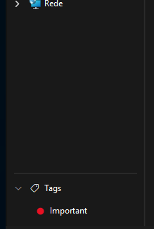
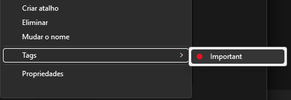

# Explorer Tags

A [Windhawk](https://windhawk.net) mod that adds colored tags to Windows 11 File
Explorer: a **Tags** panel at the bottom of the navigation pane, and a **Tags ▸**
submenu in the classic file context menu.

Windows' own tags (`System.Keywords`) only work for file types with a property
handler — not `.txt`, `.zip`, `.rar` or folders. This mod tags anything.





## What it does

- **Tag something** — drag files or folders onto a tag in the panel, or use
  **Tags ▸** in the right-click menu of the selected files.
- **See a tag's files** — click the tag. The current tab opens the tag's folder,
  which holds a shortcut per tagged file. Middle-click, or right-click ▸ **Open
  in new window**, opens it in a window of its own.
- **Remove a tag** — delete the shortcut inside the tag's folder, or uncheck the
  tag in the right-click menu. The original file is never touched.
- **Collapse the panel** — click the "Tags" title.

Tags (name and color) are defined in the mod settings.

## How files are tracked

Each tagged file is recorded by its NTFS file ID, so renaming it or moving it
within the same drive keeps the tag and fixes the shortcut. A file overwritten
by an editor (a new ID at the same path) is recognized by path. A copy on
another drive does not carry the tag.

Two places on disk:

| Path | What |
| --- | --- |
| `%USERPROFILE%\Tags\<tag>\` | one folder per tag, holding the shortcuts |
| `…\Windhawk\Engine\ModsWritable\mod-storage\explorer-tags\<your SID>\tags.tsv` | the record of what is tagged |

The record is the mod's own bookkeeping, so it lives in the storage Windhawk
keeps for the mod, in a folder per user: that storage is machine-wide, and the
record isn't — its rows point inside one profile. Uninstalling the mod (not
merely disabling it) takes the record with it; the tag folders stay.

The record lives outside the tags folder on purpose: deleting or moving the tags
folder then loses nothing, and the shortcuts are rebuilt from it. Each tag folder
carries a hidden `.tag` marker, which is how the mod tells "you deleted this
shortcut, so untag it" from "this folder is new or was rebuilt".

It works the other way round too: **the shortcuts are enough to rebuild the
record**. A shortcut sitting in a tag's folder that the record doesn't know
about is taken in — the folder says which tag, the shortcut says which file —
so losing the record (uninstalling the mod, or anything else that clears its
storage) costs nothing as long as the tag folders are still there. The same
rule means you can tag a file by putting a shortcut to it in a tag's folder
yourself. A tag whose name is no longer in the settings can't be rebuilt:
put the name back and its files come back with it.

All disk work happens on a worker thread, so an unreachable network path can
never freeze an Explorer window.

## Install

1. Install [Windhawk](https://windhawk.net).
2. Create a new mod, paste [`explorer-tags.wh.cpp`](explorer-tags.wh.cpp),
   compile it.

The context menu part needs the classic context menu — for example with the
[Classic context menu](https://windhawk.net/mods/explorer-context-menu-classic)
mod, or by holding Shift. The new Windows 11 menu is not modified.

## Build check

`compilar.sh` compiles the mod with Windhawk's own compiler and flags, without
installing anything, to catch errors and warnings:

```sh
sh compilar.sh explorer-tags.wh.cpp
```

## Worth knowing

- **Don't put the tags folder in a synced location** (OneDrive, Dropbox, a
  network share). A shortcut that is missing while the folder syncs looks
  exactly like a shortcut you deleted, and the tag goes with it. The whole
  tree under it is watched, so keep it out of busy folders too.
- **What is in the tag folders is what is tagged.** Deleting a shortcut
  removes the tag; renaming one keeps it; moving one into another tag's folder
  moves the tag; restoring one from the Recycle Bin brings the tag back. A
  shortcut that points at nothing is left alone, never deleted.
- **A tagged file in the Recycle Bin keeps its tags.** Its shortcut stays,
  pointing where the file used to be, so restoring the file makes it work
  again. Emptying the bin is what finally removes the tag.
- **The tags folder and the record stay after the mod is disabled.** A tag's
  folder appears the first time you tag something with it, or the first time you
  click it in the panel; the record folder appears with the first tag.
- **Changing the tags folder in the settings leaves the old one behind.** The
  shortcuts are rebuilt under the new folder; the old folders aren't deleted.
- **The desktop and file dialogs are left alone**, by design: the panel and the
  submenu are for Explorer windows only.

## Status

Tested on Windows 11 24H2 (26200): the panel, tag navigation, collapsing,
drag-and-drop tagging, the context menu with its check marks, renaming a tagged
file, deleting a shortcut to untag, and open views refreshing on both.

## License

MIT, see [LICENSE](LICENSE).
